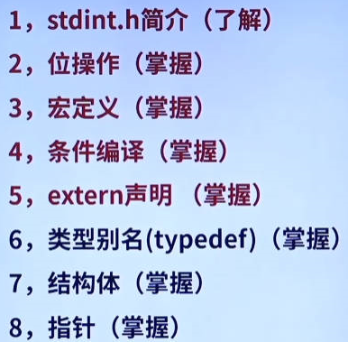
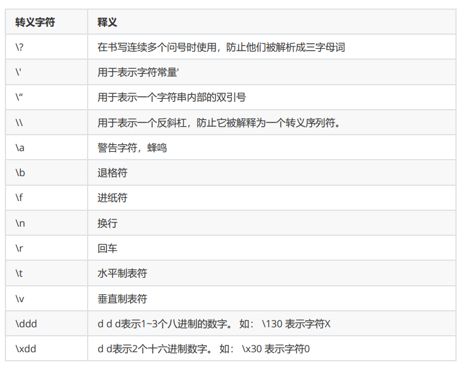
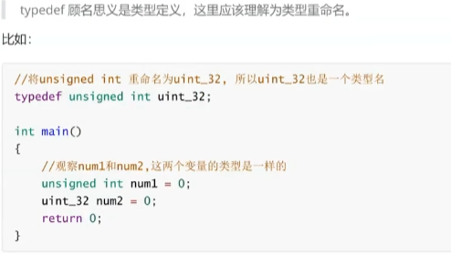
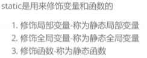
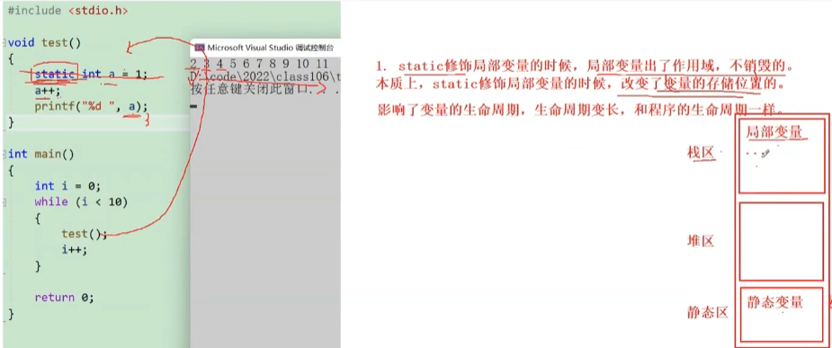
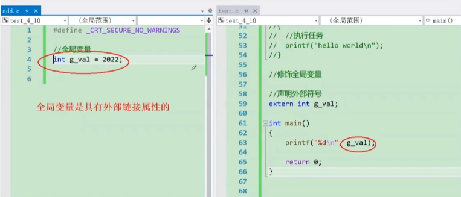
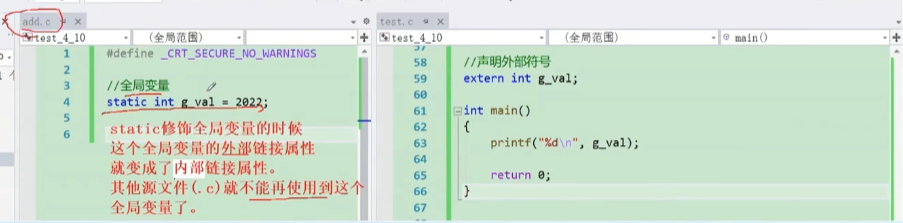
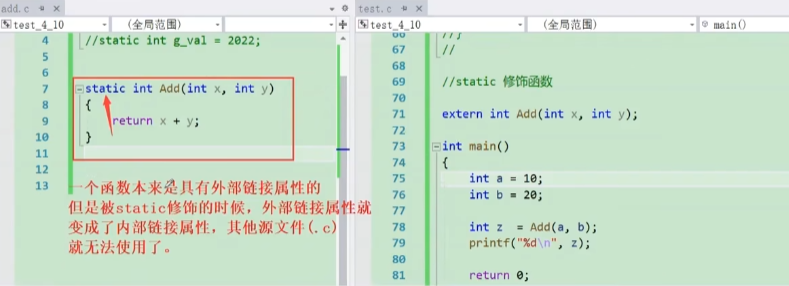
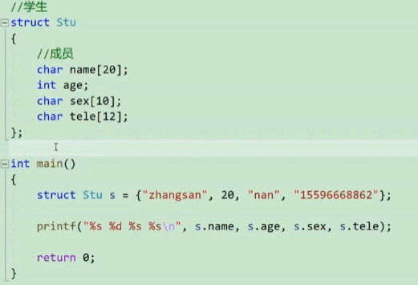
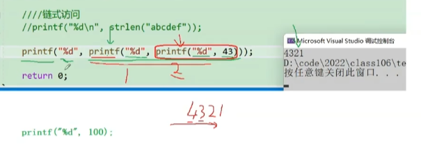

## Typora快捷键

- 加粗： `Ctrl + B`
- 撤销： `Ctrl + Z`
- 字体倾斜 ：`Ctrl+I`
- 下划线：`Ctrl+U`
- 多级标题： `Ctrl + 1~6`
- 有序列表：`Ctrl + Shift + [`
- 无序列表：`Ctrl + Shift + ]`
- 降级快捷键 ：`Tab`
- 升级快捷键：`Shift + Tab`
- 插入链接： `Ctrl + K`
- 插入公式： `Ctrl + Shift + M`
- 行内代码： `Ctrl + Shift + K`
- 插入图片： `Ctrl + Shift + I`
- 返回Typora顶部：`Ctrl+Home`
- 返回Typora底部 ：`Ctrl+End`
- 创建表格 ：`Ctrl+T`
- 选中某句话 ：`Ctrl+L`
- 选中某个单词 ：`Ctrl+D`
- 选中相同格式的文字 ：`Ctrl+E`
- 搜索: `Ctrl+F`
- 搜索并替换 ：`Ctrl+H`
- 删除线 ：`Alt+Shift+5`
- 引用 ：`Ctrl+Shift+Q`
- 生成目录：`[TOC]+Enter`

## STM32的C语言要求

 

## 转义字符

	

## strlen()

计算字符串 **str** 的长度，直到空结束字符，但不包括空结束字符

### 实例

下面的实例演示了 strlen() 函数的用法。

```c
#include <stdio.h>
#include <string.h>

int main ()
{
   char str[50];
   int len;

   strcpy(str, "This is runoob.com");

   len = strlen(str);
   printf("|%s| 的长度是 |%d|\n", str, len);
   
   return(0);
}
```

让我们编译并运行上面的程序，这将产生以下结果：

```c
|This is runoob.com| 的长度是 |18|
```

## 关键词typedef

 

相当于给类型重命名

```c
typedef unsigned int uint;
//之后可以用uint代替unsigned int
```

## 关键词static

 

##### 修饰局部变量

 

##### 修饰全局变量

 

 

##### 修饰静态函数

和修饰全局变量同理

 

## byte(字节)--bit（比特/位）

1kb=1024byte

1byte=8bit

## 指针

地址也被称为指针

不管是什么类型的指针，都是创建指针变量，指针变量大小取决于一个地址存放时需要多大空间，32位都是4byte

```c
int a = 10;
int* p = &a;
//p是指针变量，存放指针的变量，就是指针变量。
//*说明p是指针变量
&a;//取地址，找到a的地址
*p;//解应用操作符，意思是通过p里的地址，找到a，可以用*p表示a的值，此时*p=10
*p = 20;//*p表示a的地址，*p=20 a就等于20.
```

## 结构体

结构是一些值的集合，这些值称为成员变量。结构的每个成员可以是不同类型的变量。

 

s.name(结构体对象.成员名)


用指针：

 

```c
(*ps).name;//等同于
ps->name;
```

## Switch语句

case 后面必须是***整型***，***常量***表达式

## do while

break的使用：

```c
#include <stdio.h>
int main()
{
    int i = 1;
    do
    {
        if (5 == i)
            break;//i==5时直接跳出循环，打印1 2 3 4 
        printf("%d ", i);
        i = i + 1;
    } while (i <= 10);

    return 0;
}
```

continue的使用：

```c
#include <stdio.h>
int main()
{
    int i = 1;

    do
    {
        if (5 == i)
            continue;//i==5时continue到do，死循环。打印 1 2 3 4 
        printf("%d ", i);
        i = i + 1;
    } while (i <= 10);

    return 0;
}
```

## 函数链式访问

	

**链式函数的条件是：函数有访问值**

printf返回值是打印的字符的个数，比如43，就返回2

最后一个打印43，返回2

第二个打印2，返回1

第一个打印1

所以打印4321
